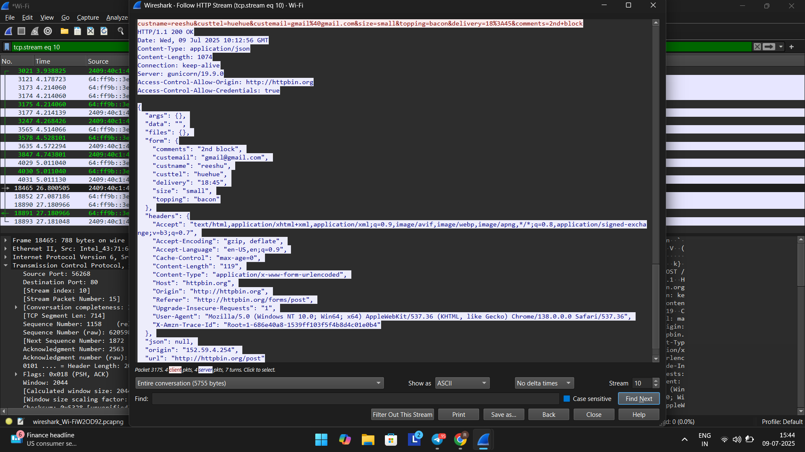
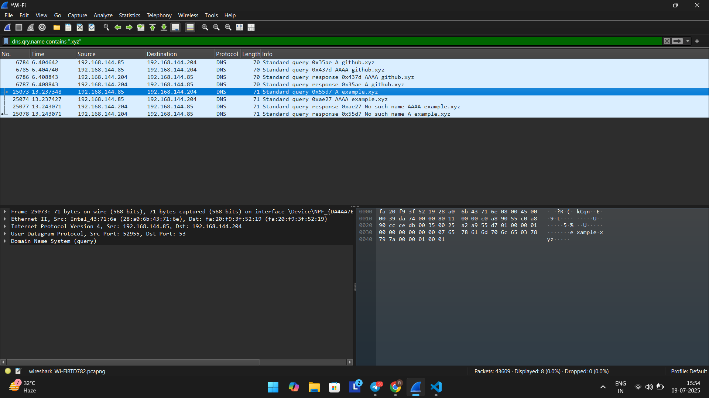

# 🛡️ Offensive Network Traffic Analysis using Wireshark

This project showcases the use of **Wireshark** from an **offensive cybersecurity perspective** to capture and analyze unencrypted network traffic.  
It demonstrates:

- 📨 Sniffing sensitive data over insecure **HTTP**
- 🌐 Analyzing **DNS queries** to detect suspicious or malicious activity

> 🧪 All demonstrations were conducted in a private lab environment using personal test devices and public web services.

---

## 🔧 Tools Used

- [Wireshark](https://www.wireshark.org/)
- Public HTTP form: [http://httpbin.org](http://httpbin.org)
- Simulated DNS queries to real and fake `.xyz` domains

---

## 📁 Contents

| Section | Description |
|---------|-------------|
| [1. HTTP Credential Sniffing](#1-http-credential-sniffing) | Intercept form data sent over unsecured HTTP |
| [2. DNS Traffic Monitoring](#2-dns-traffic-monitoring) | Observe suspicious DNS behaviors and failures |

---

## 1. 🔓 HTTP Credential Sniffing

### 🎯 Objective

Simulate a man-in-the-middle scenario where an attacker captures sensitive **form data** submitted over an insecure HTTP connection.

### 🧪 Setup

- Accessed [httpbin.org/forms/post](http://httpbin.org/forms/post)
- Submitted dummy credentials via an HTML form
- Captured the session using Wireshark
- Used `Follow TCP Stream` to reconstruct the request

### 🔍 Filters Used

```wireshark
http.request.method == "POST"
tcp.stream eq 10
ip.addr == 192.168.x.x
```

### 📸 Screenshot



> This screenshot displays intercepted form data — including name, email, delivery notes — all in plaintext, revealing how insecure HTTP can be exploited on open networks.

---

## 2. 🌐 DNS Traffic Monitoring

### 🎯 Objective

Monitor **DNS query behavior** to detect potentially malicious or uncommon domain lookups.

### 🧪 Setup

- Queried several real and non-existent `.xyz` domains such as `github.xyz` and `testdomain1234.xyz`
- Captured DNS queries and responses in Wireshark
- Focused on failed lookups and uncommon TLDs

### 🔍 Filters Used

```wireshark
dns
dns.qry.name contains ".xyz"
dns.flags.rcode != 0
ip.addr == 192.168.x.x
```

### 📸 Screenshot



> The above image shows DNS queries and responses for `.xyz` domains. Some resulted in `NXDOMAIN`, suggesting failed or suspicious lookups — a pattern often seen in malware or data exfiltration attempts.

---

## 📊 Bonus: Wireshark Statistics Used

- **Protocol Hierarchy**: To identify top-level protocols in the capture
- **Conversations & Endpoints**: To determine active IPs involved
- **IO Graphs**: For traffic analysis over time (spikes during form submission or DNS bursts)

---

## ✅ Skills Demonstrated

| Skill | Description |
|-------|-------------|
| 🧪 Live Packet Capturing | Captured real-time traffic on a local test network |
| 🔍 Protocol Filtering | Applied targeted filters for HTTP and DNS traffic |
| 🧠 Payload Reconstruction | Used stream following and hex view for in-depth analysis |
| 🔐 Adversarial Thinking | Demonstrated risk of unencrypted protocols from an attacker’s lens |

---

## 🛡️ Disclaimer

All activities in this project were performed on a **local network under controlled conditions**.  
**Do not intercept or analyze traffic** on any network without proper authorization.  
This project is intended solely for ethical and educational purposes.

---

## 👨‍💻 Author

**Reeshu Xd**  
_BCA Final Year Student | Aspiring Offensive Security Analyst_  
🔗 GitHub: [github.com/ReeshuXD](https://github.com/ReeshuXD)  
🔗 LinkedIn: [linkedin.com/in/reeshu](https://linkedin.com/in/reeshu)

---

## 📁 Project Structure

```
Wireshark-Offensive-Analysis/
├── screenshots/
│   ├── http_form_sniff.png
│   └── dns_query.png
└── README.md
```

> 📌 **Note**: The actual `.pcapng` capture files used for analysis are retained privately and can be provided upon request for educational or verification purposes.
